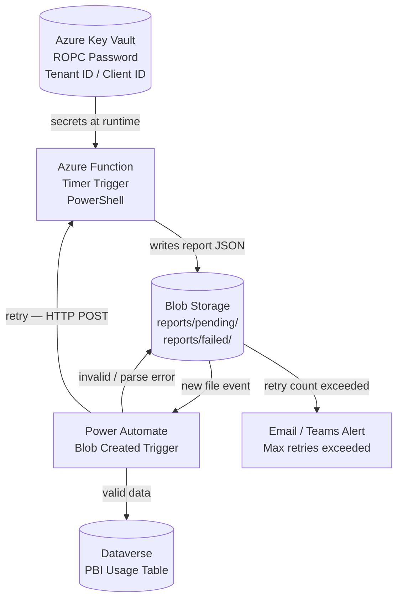
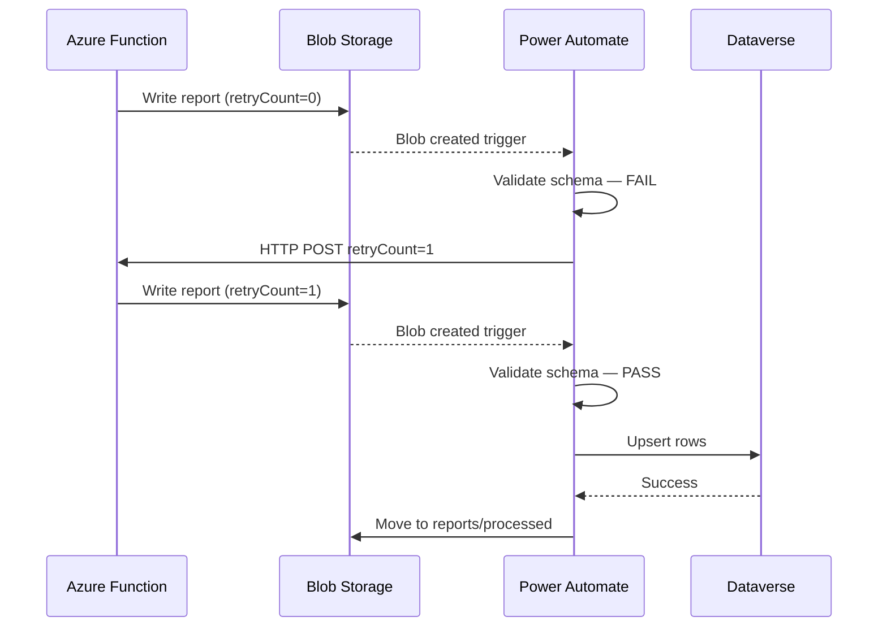

# PBI Workspace Usage → Dataverse Automation Architecture

## Overview

This document describes the automated pipeline that runs `Get-PBIWorkspaceUsageReport.ps1` on a schedule via an Azure Function, stages the output in Blob Storage, and uses a Power Automate flow to validate and load the data into Dataverse.


---
## Architecture

### High-Level Architecture

The end-to-end automation pipeline consists of five core components working together to safely collect, validate, and load Power BI usage data into Dataverse:



**Component Roles:**

- **Azure Key Vault:** Securely stores ROPC credentials (tenant ID, client ID, service account username, and password). Accessed at runtime by the Function via Managed Identity, eliminating the need to store secrets in code or configuration.

- **Azure Function:** Orchestrates the data collection on a schedule (or on-demand via HTTP POST). It retrieves credentials from Key Vault, calls the PBI Admin APIs to fetch workspace and activity data, correlates usage metrics, and outputs a JSON report blob with metadata (generatedAt, retryCount, tenantId).

- **Blob Storage:** Acts as a transient data exchange layer with three containers:
  - `reports/pending`: New reports from the Function; triggers Power Automate flows
  - `reports/processed`: Validated and successfully loaded reports; subject to lifecycle cleanup (90-day retention)
  - `reports/failed`: Dead-letter container for reports that exceeded the retry limit (default: 3 tries)

- **Power Automate:** Monitors the `reports/pending` container for new files, validates the JSON schema, and either loads valid data into Dataverse or resubmits invalid data for retry. Failures after 3 retries are moved to `reports/failed` and an alert is sent.

- **Dataverse:** The target data warehouse storing PBI usage history. The custom `pbi_workspaceusage` table uses Report ID + Report Date as the alternate key, enabling idempotent upserts.

---

### Azure Function — Internal Flow

The Function runs on a schedule (timer trigger) or is invoked on-demand (HTTP POST) by Power Automate for retries. Its core responsibility is to fetch PBI Admin data, correlate it with activity events, and stage the result as a dated JSON blob.


**Execution Flow Explained:**

1. **Trigger Entry Point:** The function receives input from either the timer trigger (scheduled) or an HTTP POST from Power Automate (retry scenario). If this is a retry, the request body contains an incremented `RetryCount`.

2. **Retry Exhaustion Check:** Before attempting data collection, the function checks if the retry count has already reached or exceeded 3. If so, the execution short-circuits to the failed blob container with error metadata, preventing unnecessary API calls.

3. **Secret Retrieval:** Using Managed Identity (no explicit credentials in code), the function calls the Azure Key Vault REST API to fetch:
   - Tenant ID and Client ID for the Entra app registration
   - Service account UPN and password for ROPC authentication

4. **ROPC Token Acquisition:** The function constructs a Resource Owner Password Credential (ROPC) token request, sending the service account credentials to the Entra token endpoint. This produces a Bearer token valid for the PBI Admin APIs.

5. **Admin Data Collection:** Two parallel or sequential API calls:
   - `GET /admin/groups` retrieves all workspaces along with their metadata and contained reports
   - `GET /admin/activityEvents?activityTypes=ViewReport` retrieves user activity (view counts) for the past N days (`ActivityDays` setting, typically 30–90 days)

6. **Data Correlation:** The function correlates report data from the groups endpoint with activity event counts to build rich usage objects containing view counts, unique user counts, and other derived metrics.

7. **Metadata Serialization:** The correlated data is serialized to JSON with a metadata header block recording:
   - `generatedAt`: ISO 8601 timestamp of execution
   - `retryCount`: Current retry iteration (helps Power Automate track state)
   - `tenantId`: For auditing and multi-tenant scenarios

8. **Blob Output:** The JSON is written to `reports/pending/` with a timestamp-based filename (e.g., `20260326_143000.json`). This write triggers a Power Automate flow.

9. **Error Handling:** If token acquisition fails or any API call errors, the function writes an error blob to `reports/failed/` with error details and exits. Power Automate monitors for this fallback path and may retrigger the function or escalate to alerting.

---

### Power Automate Flow — Internal Logic

The Power Automate cloud flow acts as the validation and ingestion gateway. It monitors the `reports/pending` container for new blobs, validates schema integrity, and either commits data to Dataverse or resubmits failed blobs for retry via HTTP POST to the Azure Function.


**Validation and Ingestion Flow:**

1. **Blob Creation Trigger:** Power Automate monitors the `reports/pending` container and fires a cloud flow whenever a new JSON file is written by the Azure Function.

2. **Content Retrieval & Parsing:** The flow reads the blob content using the Azure Blob Storage connector and attempts to parse it as JSON. The schema is validated for the presence of:
   - `generatedAt` (ISO 8601 timestamp)
   - Non-empty `workspaces` array
   - `retryCount` integer field (allows tracking retries)

3. **Schema Validation Decision:**
   - **Valid schema (→ LOOP):** Proceed to data ingestion
   - **Invalid schema (→ RETRY_CHK):** Check if this is a retry-exhausted scenario

4. **Retry Exhaustion (for invalid schemas):** If schema validation fails but `retryCount < 3`, the flow increments the counter and resubmits the blob data via HTTP POST to the Azure Function for regeneration. If `retryCount ≥ 3`, move the blob to `reports/failed/` and send an alert (Teams or Email) for manual intervention.

5. **Data Ingestion (Apply to Each):** For each workspace/report object in the valid JSON:
   - Use the Dataverse connector to upsert a row into the `pbi_workspaceusage` table
   - Match on the alternate key: **Report ID + Report Date**
   - This ensures idempotent ingestion—duplicate or reprocessed blobs do not create duplicate records

6. **Dataverse Error Handling:** If any row upsert fails (network error, validation error, permission issue):
   - Check the same retry logic: if `retryCount < 3`, resubmit to the Function; if `retryCount ≥ 3`, alert and dead-letter
   - This prevents partial ingestion states where some rows succeed and others fail

7. **Success & Cleanup:** Once all rows are successfully upserted, the flow moves the blob from `reports/pending/` to `reports/processed/` for archival. This signals completion and preps the blob for lifecycle-based cleanup (e.g., 90-day retention policy).

8. **Error Escalation:** Alerts sent for dead-lettered blobs include:
   - Blob name (timestamp)
   - Error reason (schema validation error, Dataverse error, etc.)
   - Retry count exceeded notification
   - Recipient should manually review the blob in Azure Storage and determine if data correction is needed

---

## Deployment Guide

### 1. Prerequisites

| Resource | Notes |
|---|---|
| Azure Subscription | Contributor access required |
| Azure Function App | PowerShell 7.4 runtime, Windows or Linux |
| Azure Key Vault | For ROPC credentials |
| Azure Storage Account | Blob Storage (LRS sufficient) |
| Power Automate | Premium license (Azure Blob connector is premium) |
| Dataverse environment | Table pre-created — see schema below |
| Entra App Registration | Existing SP from `Get-PBIWorkspaceUsageReport.ps1` |

---

### 2. Blob Storage Setup

Create three containers in the storage account:

| Container | Purpose |
|---|---|
| `reports/pending` | Function writes here; PA trigger watches here |
| `reports/processed` | PA moves valid blobs here after Dataverse load |
| `reports/failed` | Dead-letter — blobs that exceeded retry limit |

Set a **Lifecycle Management policy** on `reports/processed` to delete blobs older than 90 days.

---

### 3. Azure Key Vault — Secrets

Store the following secrets:

| Secret Name | Value |
|---|---|
| `pbi-tenant-id` | Entra Tenant ID |
| `pbi-client-id` | App Registration Client ID |
| `pbi-svc-username` | Service account UPN |
| `pbi-svc-password` | Service account password |

---

### 4. Azure Function App Setup

#### 4a. Enable System-Assigned Managed Identity

**Function App → Identity → System assigned → Status: On → Save**

#### 4b. Grant Managed Identity access to Key Vault

In Key Vault → **Access policies** (or RBAC if using Azure RBAC model):

- Grant the Function App's identity the **Key Vault Secrets User** role

#### 4c. Grant Managed Identity access to Blob Storage

In the Storage Account → **Access Control (IAM)**:

- Assign **Storage Blob Data Contributor** to the Function App's identity

#### 4d. Function App Settings

Add the following Application Settings (not secrets — these are non-sensitive references):

| Setting | Value |
|---|---|
| `KEY_VAULT_NAME` | Your Key Vault name |
| `BLOB_ACCOUNT_NAME` | Your Storage Account name |
| `BLOB_CONTAINER_PENDING` | `reports/pending` |
| `ACTIVITY_DAYS` | `30` (or `90` for Fabric/Premium) |

#### 4e. Deploy the Function

The Function wraps `Get-PBIWorkspaceUsageReport.ps1` with the following entry point pattern:

```powershell
# run.ps1 (timer trigger)
using namespace System.Net

param($Timer, $TriggerMetadata)

# Read retry count from binding metadata (HTTP trigger passes this)
$retryCount = $TriggerMetadata.RetryCount ?? 0

# Fetch secrets from Key Vault via Managed Identity
$kvUri     = "https://$env:KEY_VAULT_NAME.vault.azure.net"
$tenantId  = (Invoke-RestMethod "$kvUri/secrets/pbi-tenant-id?api-version=7.4" -Headers (Get-MIAuthHeader)).value
$clientId  = (Invoke-RestMethod "$kvUri/secrets/pbi-client-id?api-version=7.4" -Headers (Get-MIAuthHeader)).value
$username  = (Invoke-RestMethod "$kvUri/secrets/pbi-svc-username?api-version=7.4" -Headers (Get-MIAuthHeader)).value
$password  = (Invoke-RestMethod "$kvUri/secrets/pbi-svc-password?api-version=7.4" -Headers (Get-MIAuthHeader)).value | ConvertTo-SecureString -AsPlainText -Force

# Run the report script — output to temp path
$outPath = [System.IO.Path]::GetTempPath()
.\Get-PBIWorkspaceUsageReport.ps1 `
    -TenantId $tenantId `
    -ClientId $clientId `
    -Username $username `
    -Password $password `
    -OutputPath $outPath `
    -OutputFormat json `
    -ActivityDays $env:ACTIVITY_DAYS

# Upload result blob with retry metadata injected
# ... (upload logic using Az.Storage or REST with MI token)
```

> The full Function implementation is out of scope for this doc. The pattern above shows the secret retrieval and script invocation approach.

#### 4f. Timer Schedule

Set the CRON expression in `function.json`:

```json
{
  "schedule": "0 0 6 * * 1"
}
```

This runs **every Monday at 06:00 UTC**. Adjust to suit your reporting cadence.

---

### 5. Dataverse Table Schema

Create a custom table `pbi_workspaceusage` with the following columns:

| Display Name | Schema Name | Type | Notes |
|---|---|---|---|
| Report ID | `pbi_reportid` | Text | Unique identifier from PBI |
| Report Name | `pbi_reportname` | Text | |
| Workspace ID | `pbi_workspaceid` | Text | |
| Workspace Name | `pbi_workspacename` | Text | |
| View Count | `pbi_viewcount` | Whole Number | |
| Unique Users | `pbi_uniqueusers` | Whole Number | |
| Report Date | `pbi_reportdate` | Date Only | Date of the report run |
| Generated At | `pbi_generatedat` | Date and Time | Timestamp from JSON metadata |
| Is Personal Workspace | `pbi_ispersonal` | Yes/No | |

Use **Report ID + Report Date** as the alternate key for upsert deduplication.

---

### 6. Power Automate Flow Setup

1. **Create a new Automated Cloud Flow**
2. **Trigger:** `Azure Blob Storage — When a blob is added or modified`
   - Storage account: your account
   - Container: `reports/pending`

3. **Actions (in order):**
   - `Get blob content` — get the new file
   - `Parse JSON` — use the report schema
   - `Condition` — check schema validity (`generatedAt` exists, `workspaces` length > 0)
     - **Yes branch:** `Apply to each` over workspace rows → `Add a new row` (Dataverse, upsert on alternate key) → Move blob to `reports/processed`
     - **No branch:** Check `retryCount` field
       - **retryCount < 3:** Increment, `HTTP POST` to Function HTTP trigger URL with `{ "RetryCount": N }`
       - **retryCount ≥ 3:** Move blob to `reports/failed`, send Teams/Email alert

4. **Store the Function HTTP trigger URL** in a PA environment variable — do not hardcode it in the flow.

---

### 7. Security Notes

- The Power Automate HTTP action to re-trigger the Function must use the **Function Key** (not the master key). Store it in a PA environment variable.
- The service account used for ROPC must be excluded from any Conditional Access policies that enforce MFA or device compliance.
- Enable **Soft Delete** on the Storage Account to recover accidentally deleted blobs.
- Enable **Diagnostic Logging** on the Function App → Log Analytics workspace for alerting on failures.

---

### 8. Retry Flow Summary

The following sequence diagram illustrates the end-to-end retry mechanism, showing how a failed validation can trigger reprocessing and ultimately succeed.



**Sequence Walkthrough:**

1. **Initial Report Generation (retryCount = 0):** The Azure Function executes (either on schedule or on-demand) and writes a JSON report blob to `reports/pending/`. This blob includes metadata with `retryCount: 0`.

2. **Trigger & Validation (Initial Attempt):** The blob creation event triggers the Power Automate flow. The flow retrieves the blob content and attempts JSON schema validation.

3. **Schema Validation Failure:** The validation fails (e.g., missing `generatedAt` field, empty workspaces array, or malformed JSON). Rather than dead-lettering immediately, the flow checks the retry count.

4. **Retry Threshold Check:** Since `retryCount = 0 < 3`, the flow has remaining retries available. It increments the retry counter to 1 and constructs an HTTP POST body containing `{ "RetryCount": 1 }`.

5. **Resubmission to Function:** The flow calls the Azure Function's HTTP endpoint with the new retry count. The Function receives the `RetryCount` in its request body or metadata.

6. **Re-execution & Corrected Output:** The Function re-runs (fetching fresh data from PBI Admin APIs) and writes a new report blob with `retryCount: 1`. The retry count is also included in the JSON metadata.

7. **Second Validation Attempt:** The new blob triggers another Power Automate instance. This time, the JSON schema validates successfully (perhaps the previous failure was transient, or the Function produced corrected data).

8. **Data Ingestion:** With valid schema, the flow iterates through each workspace/report and upserts rows into the Dataverse `pbi_workspaceusage` table using the alternate key (Report ID + Date).

9. **Dataverse Acknowledgment:** Dataverse confirms successful upsert for all rows.

10. **Archival & Completion:** The Power Automate flow moves the processed blob from `reports/pending/` to `reports/processed/`, signaling successful completion. The blob is now subject to lifecycle management (e.g., deletion after 90 days).

**Retry Exhaustion Scenario:**

If the retry count reaches 3 at any point (validation failure or Dataverse upsert failure), the flow:
- Moves the blob to `reports/failed/` (dead-letter container)
- Sends a Teams or Email alert with the blob name and failure reason
- Stops further retries, requiring manual intervention to investigate and correct the underlying issue

---

*Author: Managed Solution — Will Ford*
*Last Updated: 2026-03-26*
