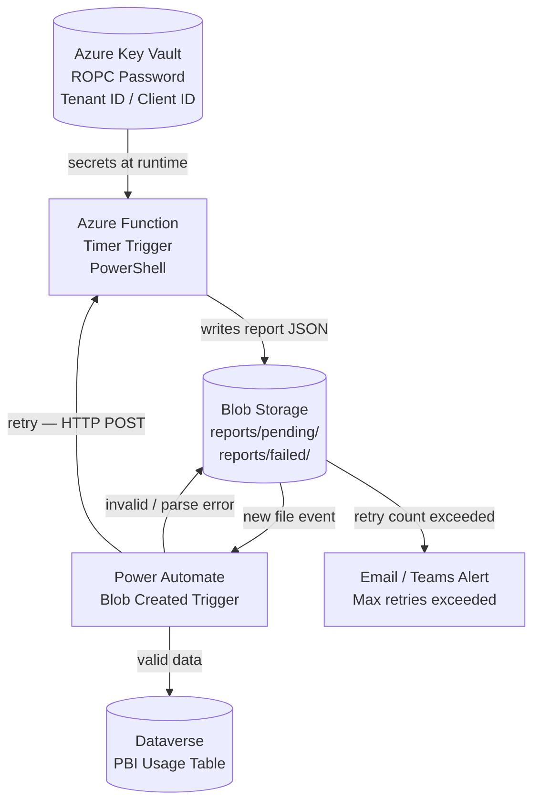
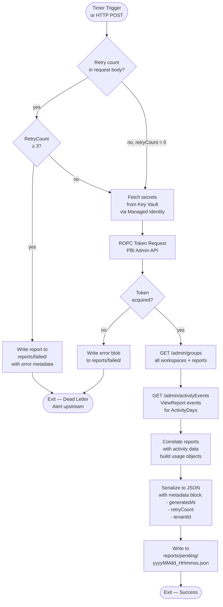
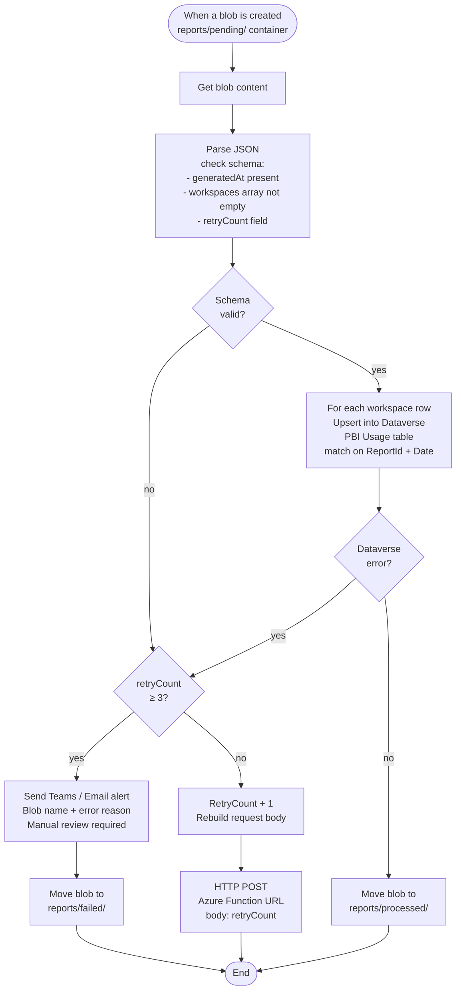
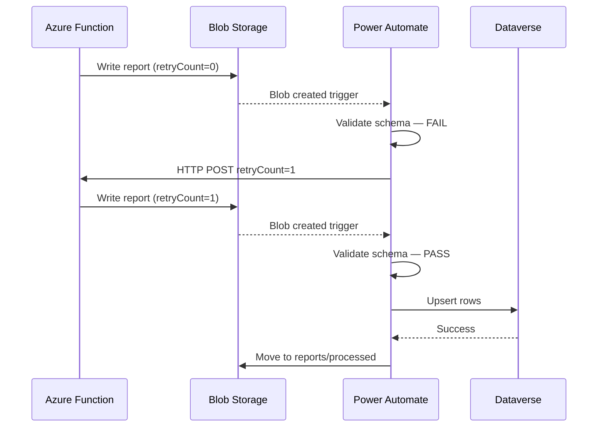

# PBI Workspace Usage → Dataverse Automation Architecture

## Overview

This document describes the automated pipeline that runs `Get-PBIWorkspaceUsageReport.ps1` on a schedule via an Azure Function, stages the output in Blob Storage, and uses a Power Automate flow to validate and load the data into Dataverse.

---

## High-Level Architecture



---

## Azure Function — Internal Flow



---

## Power Automate Flow — Internal Logic



---

## Deployment Guide

### 1. Prerequisites

| Resource | Notes |
|---|---|
| Azure Subscription | Contributor access required |
| Azure Function App | PowerShell 7.4 runtime, Windows or Linux |
| Azure Key Vault | For ROPC credentials |
| Azure Storage Account | Blob Storage (LRS sufficient) |
| Power Automate | Premium license (Azure Blob connector is premium) |
| Dataverse environment | Table pre-created — see schema below |
| Entra App Registration | Existing SP from `Get-PBIWorkspaceUsageReport.ps1` |

---

### 2. Blob Storage Setup

Create three containers in the storage account:

| Container | Purpose |
|---|---|
| `reports/pending` | Function writes here; PA trigger watches here |
| `reports/processed` | PA moves valid blobs here after Dataverse load |
| `reports/failed` | Dead-letter — blobs that exceeded retry limit |

Set a **Lifecycle Management policy** on `reports/processed` to delete blobs older than 90 days.

---

### 3. Azure Key Vault — Secrets

Store the following secrets:

| Secret Name | Value |
|---|---|
| `pbi-tenant-id` | Entra Tenant ID |
| `pbi-client-id` | App Registration Client ID |
| `pbi-svc-username` | Service account UPN |
| `pbi-svc-password` | Service account password |

---

### 4. Azure Function App Setup

#### 4a. Enable System-Assigned Managed Identity

**Function App → Identity → System assigned → Status: On → Save**

#### 4b. Grant Managed Identity access to Key Vault

In Key Vault → **Access policies** (or RBAC if using Azure RBAC model):

- Grant the Function App's identity the **Key Vault Secrets User** role

#### 4c. Grant Managed Identity access to Blob Storage

In the Storage Account → **Access Control (IAM)**:

- Assign **Storage Blob Data Contributor** to the Function App's identity

#### 4d. Function App Settings

Add the following Application Settings (not secrets — these are non-sensitive references):

| Setting | Value |
|---|---|
| `KEY_VAULT_NAME` | Your Key Vault name |
| `BLOB_ACCOUNT_NAME` | Your Storage Account name |
| `BLOB_CONTAINER_PENDING` | `reports/pending` |
| `ACTIVITY_DAYS` | `30` (or `90` for Fabric/Premium) |

#### 4e. Deploy the Function

The Function wraps `Get-PBIWorkspaceUsageReport.ps1` with the following entry point pattern:

```powershell
# run.ps1 (timer trigger)
using namespace System.Net

param($Timer, $TriggerMetadata)

# Read retry count from binding metadata (HTTP trigger passes this)
$retryCount = $TriggerMetadata.RetryCount ?? 0

# Fetch secrets from Key Vault via Managed Identity
$kvUri     = "https://$env:KEY_VAULT_NAME.vault.azure.net"
$tenantId  = (Invoke-RestMethod "$kvUri/secrets/pbi-tenant-id?api-version=7.4" -Headers (Get-MIAuthHeader)).value
$clientId  = (Invoke-RestMethod "$kvUri/secrets/pbi-client-id?api-version=7.4" -Headers (Get-MIAuthHeader)).value
$username  = (Invoke-RestMethod "$kvUri/secrets/pbi-svc-username?api-version=7.4" -Headers (Get-MIAuthHeader)).value
$password  = (Invoke-RestMethod "$kvUri/secrets/pbi-svc-password?api-version=7.4" -Headers (Get-MIAuthHeader)).value | ConvertTo-SecureString -AsPlainText -Force

# Run the report script — output to temp path
$outPath = [System.IO.Path]::GetTempPath()
.\Get-PBIWorkspaceUsageReport.ps1 `
    -TenantId $tenantId `
    -ClientId $clientId `
    -Username $username `
    -Password $password `
    -OutputPath $outPath `
    -OutputFormat json `
    -ActivityDays $env:ACTIVITY_DAYS

# Upload result blob with retry metadata injected
# ... (upload logic using Az.Storage or REST with MI token)
```

> The full Function implementation is out of scope for this doc. The pattern above shows the secret retrieval and script invocation approach.

#### 4f. Timer Schedule

Set the CRON expression in `function.json`:

```json
{
  "schedule": "0 0 6 * * 1"
}
```

This runs **every Monday at 06:00 UTC**. Adjust to suit your reporting cadence.

---

### 5. Dataverse Table Schema

Create a custom table `pbi_workspaceusage` with the following columns:

| Display Name | Schema Name | Type | Notes |
|---|---|---|---|
| Report ID | `pbi_reportid` | Text | Unique identifier from PBI |
| Report Name | `pbi_reportname` | Text | |
| Workspace ID | `pbi_workspaceid` | Text | |
| Workspace Name | `pbi_workspacename` | Text | |
| View Count | `pbi_viewcount` | Whole Number | |
| Unique Users | `pbi_uniqueusers` | Whole Number | |
| Report Date | `pbi_reportdate` | Date Only | Date of the report run |
| Generated At | `pbi_generatedat` | Date and Time | Timestamp from JSON metadata |
| Is Personal Workspace | `pbi_ispersonal` | Yes/No | |

Use **Report ID + Report Date** as the alternate key for upsert deduplication.

---

### 6. Power Automate Flow Setup

1. **Create a new Automated Cloud Flow**
2. **Trigger:** `Azure Blob Storage — When a blob is added or modified`
   - Storage account: your account
   - Container: `reports/pending`

3. **Actions (in order):**
   - `Get blob content` — get the new file
   - `Parse JSON` — use the report schema
   - `Condition` — check schema validity (`generatedAt` exists, `workspaces` length > 0)
     - **Yes branch:** `Apply to each` over workspace rows → `Add a new row` (Dataverse, upsert on alternate key) → Move blob to `reports/processed`
     - **No branch:** Check `retryCount` field
       - **retryCount < 3:** Increment, `HTTP POST` to Function HTTP trigger URL with `{ "RetryCount": N }`
       - **retryCount ≥ 3:** Move blob to `reports/failed`, send Teams/Email alert

4. **Store the Function HTTP trigger URL** in a PA environment variable — do not hardcode it in the flow.

---

### 7. Security Notes

- The Power Automate HTTP action to re-trigger the Function must use the **Function Key** (not the master key). Store it in a PA environment variable.
- The service account used for ROPC must be excluded from any Conditional Access policies that enforce MFA or device compliance.
- Enable **Soft Delete** on the Storage Account to recover accidentally deleted blobs.
- Enable **Diagnostic Logging** on the Function App → Log Analytics workspace for alerting on failures.

---

### 8. Retry Flow Summary



---

*Author: Managed Solution — Will Ford*
*Last Updated: 2026-03-26*
